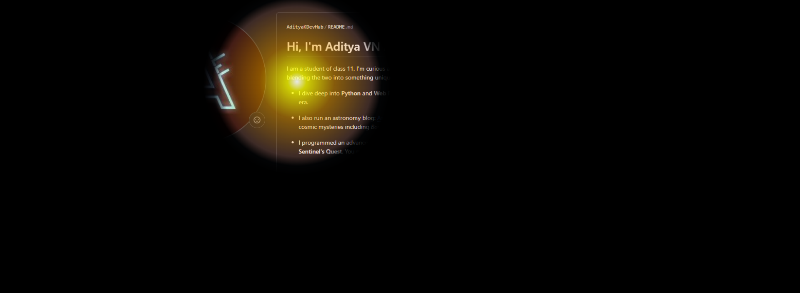

# Torch Flex
> Torch Flex is a simple, aesthetically charming webpage where the entire page is turned to black and your mouse pointer becomes a torch. You can use your torch to light up the text to read them, similar to using a torch in pitch blackness.
>
> The idea seemed super cool, and the code delivers beautifully. If this project gets enough attention, I may consider making a browser plugin out of it that uses custom torch colours and lights.
>
> Not sure why anyone would want that, but it would look very cool. \
> Attached below is a screenshot of the page. To view the effect, open the page in a device that _uses_ a mouse pointer! \
> 
>

Thank You \
Aditya VN Kadiyala
